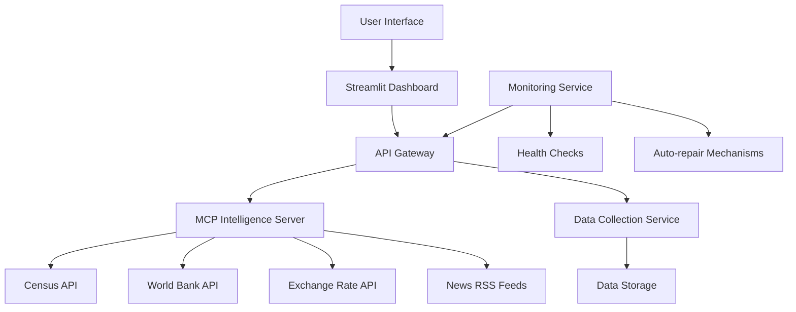

# Enhanced Architecture for Africa-USA Trade Intelligence Platform

## Current Architecture Overview

## Enhanced Architecture with New Features

```mermaid
graph TD
    A[User Interface] --> B[Streamlit Dashboard]
    A --> C[Mobile Dashboard]
    A --> D[API Clients]
    
    B --> E[API Gateway]
    C --> E
    D --> E
    
    E --> F[MCP Intelligence Server]
    E --> G[Enhanced Data Service]
    E --> H[ML Prediction Service]
    E --> I[Premium Services Module]
    
    F --> J[Market Analysis Engine]
    F --> K[Arbitrage Detector]
    F --> L[Supplier Intelligence]
    F --> M[Buyer Intelligence]
    F --> N[Content Generator]
    
    G --> O[U.S. Census API]
    G --> P[World Bank API]
    G --> Q[African Exchanges]
    G --> R[Social Media APIs]
    G --> S[Customs Data]
    
    H --> T[Price Forecasting]
    H --> U[Trend Analysis]
    H --> V[Risk Assessment]
    
    I --> W[Custom Reports]
    I --> X[Consulting Services]
    I --> Y[Training Modules]
    I --> Z[Data Products]
    
    J --> O
    J --> P
    J --> Q
    
    K --> O
    K --> P
    K --> Q
    
    L --> 1A[Supplier Database]
    M --> 1B[Buyer Database]
    N --> 1C[Content Templates]
    
    2A[Caching Layer] --> E
    2B[Authentication] --> E
    2C[Rate Limiting] --> E
    
    3A[Monitoring Service] --> E
    3A --> F
    3A --> G
    3A --> H
    3A --> I
    
    3A --> 4A[Health Checks]
    3A --> 4B[Performance Metrics]
    3A --> 4C[Auto-repair]
    3A --> 4D[Alerting]
    
    5A[GitHub Actions] --> 3A
    5A --> 6A[CI/CD Pipeline]
    5A --> 6B[Automated Testing]
    5A --> 6C[Scheduled Jobs]
    5A --> 6D[Deployment]
    
    7A[Data Lake] --> G
    7A --> H
    7A --> I

```

## Key Enhancements

### 1. Enhanced Data Service
- Integration with African commodity exchanges
- Social media sentiment analysis
- Customs and regulatory data
- Expanded geographic coverage

### 2. Machine Learning Prediction Service
- Price forecasting models
- Trend analysis algorithms
- Risk assessment tools
- Automated insights generation

### 3. Premium Services Module
- Custom report generation
- Consulting services interface
- Training module delivery
- Data product marketplace

### 4. Improved Infrastructure
- Distributed caching layer
- Enhanced authentication
- Rate limiting for APIs
- Comprehensive monitoring

## Implementation Roadmap

### Phase 1: Core Enhancements (2-3 days)
1. Enhance data collection service with new APIs
2. Improve dashboard with premium features
3. Add custom report generation capability
4. Implement enhanced caching

### Phase 2: Advanced Features (1-2 weeks)
1. Integrate machine learning prediction service
2. Add African exchange data sources
3. Implement social sentiment analysis
4. Enhance monitoring and auto-repair

### Phase 3: Premium Services (2-3 weeks)
1. Develop custom report generator
2. Create consulting services module
3. Build training platform
4. Implement data product marketplace

## Quality Assurance Measures

1. **Code Reviews**: All changes reviewed before merging
2. **Automated Testing**: GitHub Actions for continuous testing
3. **Performance Monitoring**: Real-time metrics tracking
4. **Security Audits**: Regular vulnerability assessments
5. **Documentation**: Comprehensive guides for all features

## Repository Management

1. **Branch Strategy**: 
   - `main` for stable releases
   - `development` for ongoing work
   - Feature branches for specific enhancements

2. **Commit Standards**:
   - Clear, descriptive commit messages
   - Atomic commits for easy rollback
   - Comprehensive pull request descriptions

3. **Versioning**:
   - Semantic versioning (MAJOR.MINOR.PATCH)
   - Release tags for stable versions
   - Changelog documentation

This enhanced architecture maintains the lean principles while adding significant value through intelligent design and careful implementation.