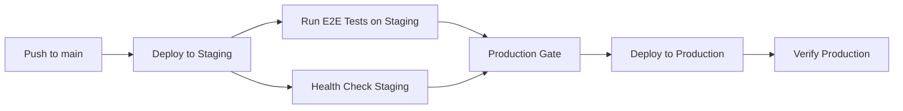

# Branch Protection & CI/CD Enhancements

This document describes the comprehensive branch protection and CI/CD pipeline enhancements implemented for the Africa-USA Trade Intelligence Platform.

## 🔐 Branch Protection Implementation

### Required Status Checks

The main branch is now protected with the following required checks:

1. **CI Pipeline** (`ci.yml`)
   - Code linting with Ruff
   - Unit tests with pytest
   - Security audit with pip-audit

2. **CodeQL Security Analysis** (`codeql.yml`)  
   - Static security analysis for Python and JavaScript
   - Runs on push, pull request, and weekly schedule
   - Uses security-extended query suite

3. **E2E Smoke Tests** (`e2e-smoke.yml`)
   - Health endpoint verification
   - Dashboard accessibility testing
   - Critical API endpoint testing
   - Reusable workflow for staging and production

4. **Observability Monitoring** (`observability.yml`)
   - SLO breach detection (availability, response time, error rate)
   - Prometheus metrics export
   - Automated incident creation for SLO violations

### Branch Protection Rules

- ✅ Require status checks to pass before merging
- ✅ Require branches to be up to date before merging  
- ✅ Require pull request reviews (minimum 1 approval)
- ✅ Dismiss stale reviews when new commits are pushed
- ✅ Require conversation resolution before merging
- ✅ Prevent force pushes and branch deletion
- ⚠️ Allow admin override for emergency fixes

## 🚀 Staged Deployment Pipeline

### Deployment Flow



### Environments

1. **Staging Environment**
   - Automatic deployment on main branch push
   - Full smoke test suite execution
   - Health stability verification (5 checks, 80% success required)

2. **Production Gate**
   - Requires staging tests to pass
   - Requires staging health checks to pass
   - Manual approval environment for critical deployments

3. **Production Environment**
   - Deploys only after all staging gates pass
   - Immediate post-deployment verification
   - Final smoke test execution

## 🤖 Auto-Fix Enhancements

### Tunable Configuration

- **Scope Options**:
  - `src/` (default) - Focus on source code only
  - `all` - Apply to entire repository
  - `changed-files-only` - Only files modified in recent commits

- **Cadence Control**:
  - Default: Every 4 hours
  - Intelligent rate limiting prevents PR noise
  - Manual override with `force_run` option

### Auto-Fix Features

- Black code formatting
- Ruff linting with auto-fixes
- Scoped application based on trigger
- Smart branch naming with timestamps
- Comprehensive PR descriptions
- Post-fix test execution

## 🚨 Incident Lifecycle Management

### Automatic Incident Handling

1. **Detection & Assignment**
   - Auto-assign to repository owner (@trooths2002)
   - Severity classification based on keywords
   - Priority labeling (P0-P3)

2. **Severity Levels**
   - **Critical**: production/outage/down keywords → P0, immediate alerts
   - **High**: error/failing keywords → P1, high priority
   - **Medium**: standard issues → P2, normal workflow
   - **Low**: minor/enhancement keywords → P3, low priority

3. **Escalation Policy**
   - Critical incidents: Immediate Slack/email alerts
   - Stale incidents: Auto-escalation after 2 hours
   - Resolution tracking with timestamps

4. **Alert Channels**
   - Email: temangroup1930@gmail.com
   - Slack: #incidents channel (configurable)
   - PagerDuty: Integration ready (requires setup)

## 📊 Observability & Alerting

### SLO Monitoring

- **Availability SLO**: 99.0% uptime
- **Response Time SLO**: 2000ms average
- **Error Rate SLO**: 1.0% maximum

### Metrics Collection

- Response time per endpoint
- HTTP status codes and availability
- Error rates and success rates  
- Request volume metrics

### Prometheus Export

All metrics are exported in Prometheus format:
```
application_availability_percent 99.5 1640995200000
application_response_time_ms 1250 1640995200000
endpoint_response_time_ms{endpoint="/health"} 150 1640995200000
```

### SLO Breach Response

1. **Automatic Detection**: Every 15 minutes
2. **Incident Creation**: Auto-created GitHub issue
3. **Alerting**: Slack/Email notifications
4. **Escalation**: Repository owner assignment

## 🔧 Setup Instructions

### 1. Configure Branch Protection

```bash
# Set your GitHub token
export GITHUB_TOKEN="your_github_token_here"

# Run the configuration script
python scripts/configure_branch_protection.py
```

### 2. Required GitHub Secrets

```yaml
# Email notifications
EMAIL_SENDER: your-email@gmail.com
EMAIL_PASSWORD: your-app-password

# Environment URLs  
DEPLOYED_URL: https://africa-usa-trade-intelligence.onrender.com
STAGING_URL: https://staging-africa-usa-trade-intelligence.onrender.com

# Optional: Alert integrations
SLACK_WEBHOOK_URL: https://hooks.slack.com/services/...
PAGERDUTY_API_KEY: your-pagerduty-key
```

### 3. Repository Variables

```yaml
# Set in Repository Settings > Variables
DEPLOYED_URL: https://africa-usa-trade-intelligence.onrender.com
STAGING_URL: https://staging-africa-usa-trade-intelligence.onrender.com
```

## 🎯 Workflow Triggers

| Workflow | Trigger | Purpose |
|----------|---------|---------|
| CI | Push/PR to main | Basic validation |
| CodeQL | Push/PR + Weekly | Security analysis |  
| E2E Smoke | Push/PR + Reusable | End-to-end testing |
| Staged Deployment | Push to main | Deployment pipeline |
| Observability | Every 15 min | SLO monitoring |
| Auto-Fix | Every 4 hours + Issues | Code maintenance |
| Incident Management | Issues labeled 'incident' | Lifecycle automation |

## 📈 Monitoring Dashboard

### Key Metrics

- System availability percentage
- Average response time trends  
- Error rate tracking
- Deployment success rates
- Auto-fix PR creation rates
- Incident resolution times

### Alerts & Notifications

- **SLO Breaches**: Immediate GitHub issue + alerts
- **Critical Incidents**: Multi-channel notifications
- **Deployment Failures**: Staging gate failures
- **Stale Incidents**: 2-hour escalation timer

## 🔄 Auto-Fix Scope Tuning

### Reducing PR Noise

If auto-fix creates too many PRs:

1. **Increase Cadence**: Change from 4 hours to 8 hours
   ```yaml
   - cron: '0 */8 * * *'  # Every 8 hours
   ```

2. **Limit to Changed Files**:
   ```bash
   # Use workflow dispatch with scope
   scope: 'changed-files-only'
   ```

3. **Reduce Scope**: Keep default `src/` scope instead of `all`

### Monitoring Auto-Fix Impact

- Track auto-fix PR merge rates
- Monitor test failure rates in auto-fix PRs  
- Review manual intervention requirements

## 🚨 Emergency Procedures

### Bypass Branch Protection

Admins can bypass protection for emergency fixes:

1. Push directly to main (admin override enabled)
2. Create hotfix PR with emergency label
3. Document override reason in commit message

### Production Rollback

```bash
# Via GitHub Actions
gh workflow run staged-deployment.yml -f force_production_deploy=true

# Manual deployment override
# (Implement based on your deployment system)
```

### Incident Response

1. **Critical Issue**: GitHub will auto-create incident
2. **Check Alerts**: Monitor #incidents Slack channel
3. **Acknowledge**: Comment on GitHub issue  
4. **Mitigate**: Follow incident response procedures
5. **Resolve**: Close issue with resolution details

## 📋 Validation Checklist

After implementation, verify:

- [ ] All required workflows exist and are enabled
- [ ] Branch protection rules are active on main branch
- [ ] Staging and production environments are configured
- [ ] Required secrets and variables are set
- [ ] SLO thresholds are appropriate for your service
- [ ] Notification channels are working
- [ ] Auto-fix scope and cadence are suitable

## 🔍 Troubleshooting

### Common Issues

1. **Status Check Not Found**
   - Ensure workflow names match exactly
   - Check workflow is enabled and running
   - Verify branch protection configuration

2. **Deployment Failures**
   - Check environment configuration
   - Verify deployment URLs are accessible
   - Review staging health check requirements

3. **Too Many Auto-Fix PRs**
   - Increase cadence in workflow schedule
   - Reduce scope to `src/` or `changed-files-only`
   - Review file patterns in auto-fix logic

4. **Missing Notifications**
   - Verify GitHub secrets are set correctly
   - Check email SMTP configuration
   - Test Slack webhook integration

## 📚 Additional Resources

- [GitHub Branch Protection API](https://docs.github.com/en/rest/branches/branch-protection)
- [CodeQL Documentation](https://codeql.github.com/)
- [Prometheus Metrics Guide](https://prometheus.io/docs/concepts/metric_types/)
- [GitHub Environments](https://docs.github.com/en/actions/deployment/targeting-different-environments)