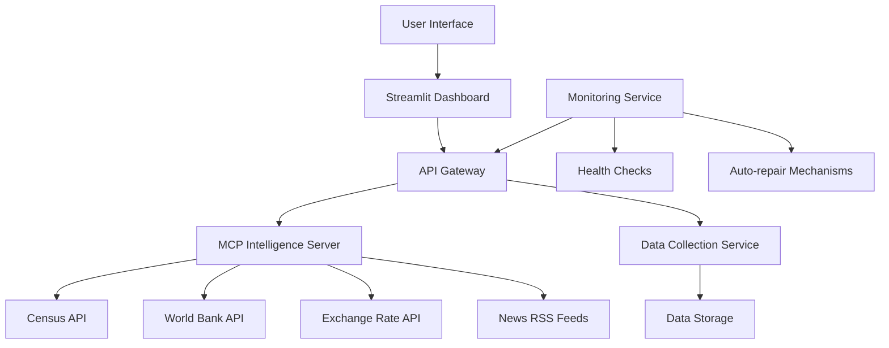

# Clean Architecture for Africa-USA Trade Intelligence Platform

## Overview
This document outlines a simplified, efficient architecture for the Africa-USA Trade Intelligence Platform that focuses on:
- Lean, simple, and lightweight implementation
- Intelligent, self-assessing, and self-repairing systems
- $0 cost operation using 100% free resources
- Maximum productivity through MCP servers

## Architecture Diagram


## Core Components

### 1. Streamlit Dashboard (Frontend)
- Single, unified dashboard for all intelligence
- Real-time data visualization
- Interactive controls for market analysis
- Buyer/supplier management interface

### 2. API Gateway (Middleware)
- Single entry point for all API requests
- Request routing and load balancing
- Caching layer for performance
- Rate limiting and security

### 3. MCP Intelligence Server (Backend)
- Market analysis and arbitrage detection
- Buyer/supplier intelligence
- Social media automation
- Expert content generation

### 4. Data Collection Service
- Automated data collection from free APIs
- Data validation and cleaning
- Storage in local cache/database
- Scheduled collection tasks

### 5. Monitoring Service
- Health checks for all components
- Automated error detection and repair
- Performance monitoring
- Alerting system

## Key Principles

### 1. Lean Implementation
- Minimal codebase with maximum functionality
- No redundant features or duplicate implementations
- Clear separation of concerns
- Single responsibility principle for each component

### 2. Intelligent Automation
- Self-monitoring and self-healing capabilities
- Automated data collection and analysis
- Smart caching to reduce API calls
- Predictive analytics for market trends

### 3. Zero Cost Operation
- 100% free APIs and services
- No paid tiers or premium features
- Efficient resource utilization
- Scalable within free tier limits

### 4. Maximum Productivity
- MCP servers for intelligent automation
- Streamlined workflows
- Real-time data processing
- Expert positioning tools

## File Structure
```
africa-usa-trade-intelligence/
├── README.md
├── requirements.txt
├── .env.example
├── main.py                 # Entry point
├── config/                 # Configuration files
│   ├── settings.py
│   licate.toml
├── src/
│   ├── dashboard/          # Streamlit frontend
│   │   ├── app.py
│   │   ├── components/
│   │   └── utils.py
│   ├── api/                # API gateway
│   │   ├── main.py
│   │   ├── routes/
│   │   └── middleware.py
│   ├── intelligence/       # MCP intelligence server
│   │   ├── server.py
│   │   ├── tools/
│   │   └── utils.py
│   ├── data/               # Data collection service
│   │   ├── collector.py
│   │   ├── storage.py
│   │   └── sources/
│   └── monitoring/         # Monitoring service
│       ├── health.py
│       ├── repair.py
│       └── alerts.py
├── data/                   # Local data storage
│   ├── cache/
│   ├── logs/
│   └── reports/
└── tests/                  # Automated tests
    ├── test_api.py
    ├── test_intelligence.py
    └── test_dashboard.py
```

## Implementation Roadmap

### Phase 1: Core Infrastructure
1. Create simplified file structure
2. Implement API gateway with caching
3. Set up MCP intelligence server
4. Create basic Streamlit dashboard

### Phase 2: Data Integration
1. Integrate Census API for trade data
2. Add World Bank for commodity prices
3. Implement exchange rate collection
4. Add news RSS feed parsing

### Phase 3: Intelligence Features
1. Market analysis algorithms
2. Arbitrage opportunity detection
3. Buyer/supplier intelligence
4. Social media automation

### Phase 4: Monitoring & Automation
1. Health check system
2. Auto-repair mechanisms
3. Performance monitoring
4. Alerting system

### Phase 5: Optimization
1. Performance tuning
2. User experience improvements
3. Documentation
4. Deployment automation

## Benefits of This Approach

1. **Simplicity**: Clean, focused architecture with no redundancy
2. **Efficiency**: Intelligent caching and automated processes
3. **Reliability**: Self-monitoring and self-repairing systems
4. **Scalability**: Designed to grow within free tier limits
5. **Maintainability**: Clear structure makes updates easy
6. **Cost-effectiveness**: 100% free operation
7. **Productivity**: MCP servers maximize automation potential