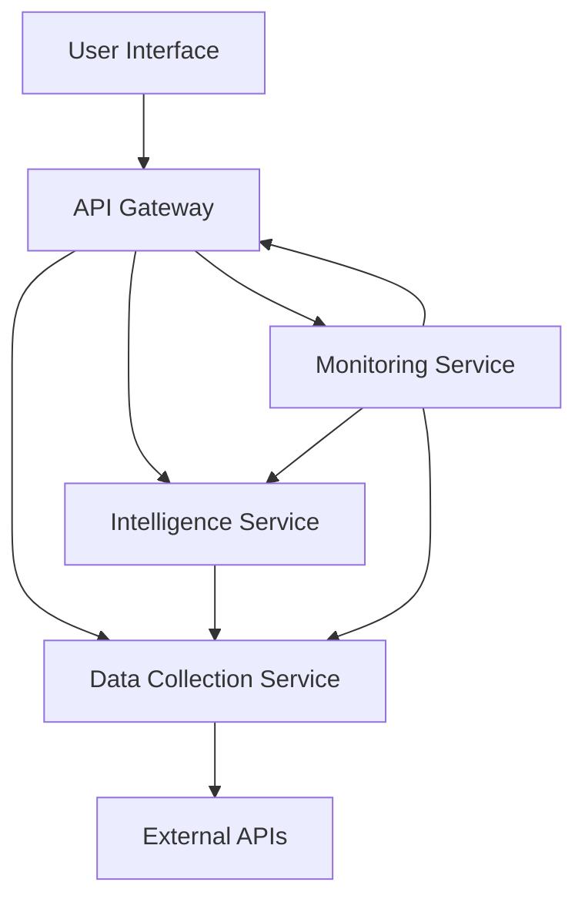

# Africa-USA Trade Intelligence Platform

## Overview
This platform provides real-time market intelligence and arbitrage opportunities for Africa-USA agricultural trade. It's designed to help Terrence Dupree become the #1 Africa-USA agriculture broker globally through intelligent automation and expert positioning.

## 🎯 Mission
Become the most sought-after broker salesman for Africa-to-USA agriculture trade by leveraging:
- **MCP Server Automation** for 10x productivity gains
- **Real-time Market Intelligence** for arbitrage opportunities
- **Expert Social Media Positioning** across all platforms
- **Free Technology Stack** for maximum ROI

## 📊 Market Opportunity
- **Total Market Size**: $2.8B Africa-USA agriculture trade
- **Target Share**: 3-5% ($150M-$250M annually)
- **Commission Potential**: $10M+ annually at scale
- **AGOA Benefits**: 6,700+ duty-free products from 32 countries

## 🚀 Technology Stack (100% Free Resources)

### Core Platform
- **Language**: Python 3.8+ (Free, cross-platform)
- **MCP Framework**: Model Context Protocol (Open source)
- **Web Framework**: FastAPI (Free, high-performance)
- **Frontend**: Streamlit (Free, rapid development)
- **Database**: SQLite (Built-in, zero cost)

### Data Sources (Free APIs)
- **US Trade Data**: Census Bureau API (Free, unlimited, official)
- **Commodity Prices**: World Bank API (Free, unlimited)
- **Currency Rates**: ExchangeRate.host API (Free, unlimited)
- **News Intelligence**: RSS Feeds (Free, unlimited)

### Infrastructure (Free Hosting)
- **Code Repository**: GitHub (Free)
- **CI/CD**: GitHub Actions (Free)
- **Hosting**: Local development (Free)
- **Monitoring**: Built-in health checks (Free)

## 📁 Repository Structure

```
africa-usa-trade-intelligence/
├── README.md
├── STANDARD_ARCHITECTURE.md
├── requirements.txt
├── .env.example
├── src/
│   ├── main.py                 # Main entry point
│   ├── api/
│   │   └── main.py            # FastAPI server
│   ├── dashboard/
│   │   └── app.py             # Streamlit dashboard
│   ├── data/
│   │   └── collector.py       # Data collection service
│   ├── intelligence/
│   │   └── server.py          # MCP intelligence server
│   ├── monitoring/
│   │   └── health.py          # Health monitoring
│   └── test_imports.py        # Import testing
└── tests/
```

## 🎯 Key Features

### 1. **Real-Time Market Intelligence**
- Commodity price monitoring (50+ African products)
- Arbitrage opportunity detection (20%+ margin alerts)
- Import/export trend analysis
- Competitive intelligence tracking

### 2. **African Market Intelligence**
- Integration with major African commodity exchanges
- Social media sentiment analysis for key products
- Comprehensive market analysis and opportunity identification
- Real-time price tracking for African commodities

### 3. **Custom Report Generation**
- Executive summaries with market overviews
- Detailed price analysis for US and African markets
- Supply chain insights and recommendations
- Risk assessments with mitigation strategies
- Actionable recommendations for clients

### 4. **Intelligent Automation**
- Daily market briefings
- Automated outreach campaigns
- Performance analytics
- Risk monitoring and alerts

## 🏗️ Standard Architecture

The platform follows a clean architecture with clear separation of concerns:



See [STANDARD_ARCHITECTURE.md](STANDARD_ARCHITECTURE.md) for detailed architecture documentation.

## 🚀 Quick Start

### Prerequisites
- Python 3.8 or higher
- pip package manager

### Installation
1. Clone the repository:
   ```bash
   git clone <repository-url>
   cd africa-usa-trade-intelligence
   ```

2. Install dependencies:
   ```bash
   pip install -r src/requirements.txt
   ```

3. Configure environment variables:
   ```bash
   cp .env.example .env
   ```
   Edit the `.env` file to set your configuration, including the API URL for the Streamlit dashboard.

3. Start all services:
   ```bash
   python src/main.py
   ```

4. Access the platform:
   - Dashboard: http://localhost:8501
   - API Documentation: http://localhost:8000/docs

## ☁️ Deployment Options

### Render (Recommended Free Option)
1. Fork this repository to your GitHub account
2. Sign up at [render.com](https://render.com)
3. Create a new Web Service
4. Connect your GitHub repository
5. Set the following environment variables:
   - `PYTHON_VERSION`: 3.10.8
6. Deploy!

### Railway (Alternative Free Option)
1. Fork this repository to your GitHub account
2. Sign up at [railway.app](https://railway.app)
3. Create a new project
4. Connect your GitHub repository
5. Deploy!

### Docker (Self-Hosted)
1. Build the Docker image:
   ```bash
   docker build -t africa-usa-trade-intelligence .
   ```
2. Run the container:
   ```bash
   docker run -p 8000:8000 africa-usa-trade-intelligence
   ```

## 📦 Core Components

### 1. Streamlit Dashboard (`src/dashboard/app.py`)
- Single-page application for user interaction
- Real-time data visualization
- Custom report generation interface
- African market intelligence display
- Configurable API endpoint via environment variables (STREAMLIT_API_URL)

### 2. FastAPI Server (`src/api/main.py`)
- RESTful API endpoints for all services
- Health monitoring endpoints
- African market intelligence API
- Custom report generation API

### 3. MCP Intelligence Server (`src/intelligence/server.py`)
- Market analysis and opportunity detection
- Custom report generation
- Expert content creation
- MCP protocol implementation

### 4. Data Collection Service (`src/data/collector.py`)
- Integration with external APIs
- Data caching and validation
- African market data collection
- Social media sentiment analysis

### 5. Monitoring Service (`src/monitoring/health.py`)
- Service health checks
- Performance monitoring
- System status reporting

## 🛠️ API Endpoints

### Health Check
- `GET /health` - System health status

### Market Data
- `GET /census-data` - US Census trade data
- `GET /exchange-rates` - Currency exchange rates
- `GET /commodity-prices` - Commodity prices
- `GET /trade-news` - Trade news and updates

### African Markets
- `GET /african-markets` - Comprehensive African market intelligence
- `GET /custom-report` - Custom market analysis reports

## 📈 Premium Services

### 1. Custom Market Intelligence Reports
- **Price**: $500-2000 per report
- **Features**: Executive summaries, price analysis, supply chain insights, risk assessments

### 2. Consulting Services
- **Price**: $500/hour
- **Features**: Market entry strategy, supplier identification, buyer matching

### 3. Training Modules
- **Price**: $299/course
- **Features**: AGOA compliance, market analysis, negotiation skills

### 4. Data Products
- **Price**: Subscription model
- **Features**: Real-time data feeds, market alerts, trend analysis