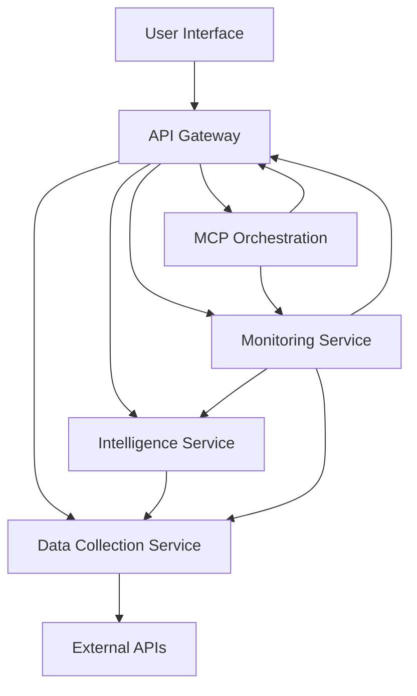

# Africa-USA Trade Intelligence Platform

## Overview
This platform provides real-time market intelligence and arbitrage opportunities for Africa-USA agricultural trade. It's designed to help Terrence Dupree become the #1 Africa-USA agriculture broker globally through intelligent automation and expert positioning.

## 🎯 Mission
Become the most sought-after broker salesman for Africa-to-USA agriculture trade by leveraging:
- **MCP Server Automation** for 10x productivity gains
- **Real-Time Market Intelligence** for arbitrage opportunities
- **Expert Social Media Positioning** across all platforms
- **Free Technology Stack** for maximum ROI

## 📊 Market Opportunity
- **Total Market Size**: $2.8B Africa-USA agriculture trade
- **Target Share**: 3-5% ($150M-$250M annually)
- **Commission Potential**: $10M+ annually at scale
- **AGOA Benefits**: 6,700+ duty-free products from 32 countries

## 🚀 Technology Stack (100% Free Resources)

### Core Platform
- **Language**: Python 3.8+ (Free, cross-platform)
- **MCP Framework**: Model Context Protocol (Open source)
- **Web Framework**: FastAPI (Free, high-performance)
- **Frontend**: Streamlit (Free, rapid development)
- **Database**: SQLite (Built-in, zero cost)

### Data Sources (Free APIs)
- **US Trade Data**: Census Bureau API (Free, unlimited, official)
- **Commodity Prices**: World Bank API (Free, unlimited)
- **Currency Rates**: ExchangeRate.host API (Free, unlimited)
- **News Intelligence**: RSS Feeds (Free, unlimited)

### Infrastructure (Free Hosting)
- **Code Repository**: GitHub (Free)
- **CI/CD**: GitHub Actions (Free)
- **Hosting**: Local development (Free)
- **Monitoring**: Built-in health checks (Free)

## 📁 Repository Structure

```
africa-usa-trade-intelligence/
├── README.md
├── STANDARD_ARCHITECTURE.md
├── requirements.txt
├── .env.example
├── Makefile
├── pyproject.toml
├── setup.py
├── src/
│   ├── main.py                 # Main entry point
│   ├── api/
│   │   └── main.py            # FastAPI server
│   ├── dashboard/
│   │   └── app.py             # Streamlit dashboard
│   ├── data/
│   │   └── collector.py       # Data collection service
│   │   └── jobs/              # Data ingestion jobs
│   ├── intelligence/
│   │   └── server.py          # MCP intelligence server
│   ├── monitoring/
│   │   ├── health.py          # Health monitoring
│   │   ├── agent.py           # Continuous monitoring agent
│   │   ├── dashboard_monitor.py # Dashboard monitor
│   │   └── dashboard.py       # Monitoring web interface
│   └── test_imports.py        # Import testing
├── .github/
│   ├── workflows/             # GitHub Actions workflows
│   └── mcp/                   # MCP orchestrator and agents
└── tests/
```

## 🎯 Key Features

### 1. **Real-Time Market Intelligence**
- Commodity price monitoring (50+ African products)
- Arbitrage opportunity detection (20%+ margin alerts)
- Import/export trend analysis
- Competitive intelligence tracking

### 2. **African Market Intelligence**
- Integration with major African commodity exchanges
- Social media sentiment analysis for key products
- Comprehensive market analysis and opportunity identification
- Real-time price tracking for African commodities

### 3. **Custom Report Generation**
- Executive summaries with market overviews
- Detailed price analysis for US and African markets
- Supply chain insights and recommendations
- Risk assessments with mitigation strategies
- Actionable recommendations for clients

### 4. **Intelligent Automation**
- Daily market briefings
- Automated outreach campaigns
- Performance analytics
- Risk monitoring and alerts

### 5. **Continuous Improvement**
- Automated code review and improvement
- Continuous testing and deployment
- Performance monitoring and optimization
- Security scanning and vulnerability detection

### 6. **System Monitoring**
- 24/7 automated monitoring of all components
- Hourly status reports sent to temangroup1930@gmail.com
- Automatic correction of common issues
- Real-time dashboard for monitoring results

### 7. **MCP Orchestration**
- Automated task coordination using GitHub Issues
- Health monitoring and incident management
- Auto-fix agents for formatting and linting
- Human-agent collaboration through issue tracking

## 🏗️ Standard Architecture

The platform follows a clean architecture with clear separation of concerns:



See [STANDARD_ARCHITECTURE.md](STANDARD_ARCHITECTURE.md) for detailed architecture documentation.

## 🚀 Quick Start

### Prerequisites
- Python 3.8 or higher
- pip package manager

### Installation
1. Clone the repository:
   ```bash
   git clone <repository-url>
   cd africa-usa-trade-intelligence
   ```

2. Install dependencies (recommended approach):
   ```bash
   pip install -e .
   ```

   Or using Makefile:
   ```bash
   make setup
   ```

3. Configure environment variables:
   ```bash
   cp .env.example .env
   ```
   Edit the `.env` file to set your configuration, including the API URL for the Streamlit dashboard.

4. Start all services:
   ```bash
   python src/main.py
   ```

5. Access the platform:
   - Dashboard: http://localhost:8501
   - API Documentation: http://localhost:8000/docs

## 🛠️ Development Commands

The platform includes a Makefile with common development commands:

```bash
# Install package in development mode
make setup

# Run data ingestion jobs
make ingest-census
make ingest-fred
make ingest-wb
make fx-rates
make arbitrage

# Run all data ingestion jobs
make all-data

# Run tests
make test

# Run code linting
make lint

# Check service health
make health
```

Alternatively, you can use the installed console scripts:
```bash
ingest-census
ingest-fred
ingest-wb
fx-rates
refresh-arbitrage
```

## ☁️ Deployment Options

### Render (Recommended Free Option)
1. Fork this repository to your GitHub account
2. Sign up at [render.com](https://render.com)
3. Create a new Web Service
4. Connect your GitHub repository
5. Set the following environment variables:
   - `PYTHON_VERSION`: 3.10.8
6. Deploy!

### Railway (Alternative Free Option)
1. Fork this repository to your GitHub account
2. Sign up at [railway.app](https://railway.app)
3. Create a new project
4. Connect your GitHub repository
5. Deploy!

### Docker (Self-Hosted)
1. Build the Docker image:
   ```bash
   docker build -t africa-usa-trade-intelligence
   ```
2. Run the container:
   ```bash
   docker run -p 8000:8000 africa-usa-trade-intelligence
   ```

## 🤖 Continuous Development System

This platform features a fully automated continuous development system that continuously improves, tests, and deploys enhancements without human intervention. See [CONTINUOUS_DEVELOPMENT.md](CONTINUOUS_DEVELOPMENT.md) for complete details.