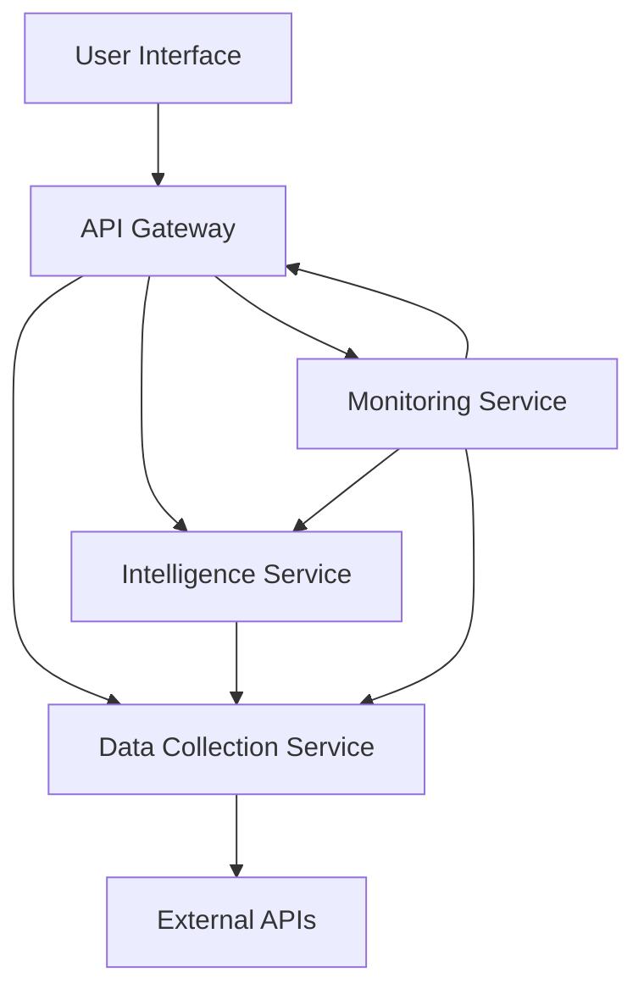

# Standard Architecture for Africa-USA Trade Intelligence Platform

## Overview
This document describes the standardized architecture for the Africa-USA Trade Intelligence Platform. The architecture follows clean principles with clear separation of concerns, ensuring a lean, maintainable, and scalable system.

## Architecture Diagram

## Component Layers

### 1. User Interface Layer
- **Streamlit Dashboard** (`src/dashboard/app.py`)
  - Single-page application for user interaction
  - Real-time data visualization
  - Custom report generation interface

### 2. API Gateway Layer
- **FastAPI Server** (`src/api/main.py`)
  - Single entry point for all client requests
  - Request routing and validation
  - API documentation generation

### 3. Service Layer
- **Intelligence Service** (`src/intelligence/server.py`)
  - Market analysis and opportunity detection
  - Custom report generation
  - Expert content creation
  - MCP server implementation

- **Data Collection Service** (`src/data/collector.py`)
  - Integration with external APIs
  - Data caching and validation
  - African market data collection

### 4. Monitoring Layer
- **Health Monitoring** (`src/monitoring/health.py`)
  - Service health checks
  - Performance monitoring
  - System status reporting

## Data Flow

1. User interacts with Streamlit dashboard
2. Dashboard makes requests to API gateway
3. API gateway routes requests to appropriate services
4. Services process data and return responses
5. Dashboard displays results to user
6. Monitoring service tracks system health

## Benefits

- **Modularity**: Each component has a single responsibility
- **Scalability**: Services can be scaled independently
- **Maintainability**: Clear separation makes updates easier
- **Testability**: Components can be tested in isolation
- **Reliability**: Health monitoring ensures system stability

## Implementation Guidelines

1. All services should be stateless where possible
2. Use dependency injection for service initialization
3. Implement proper error handling and logging
4. Follow consistent naming conventions
5. Maintain comprehensive documentation
6. Write unit tests for critical functionality

## Future Enhancements

1. Add database layer for persistent storage
2. Implement authentication and authorization
3. Add caching layer for improved performance
4. Enhance monitoring with alerting capabilities
5. Implement automated testing pipelines